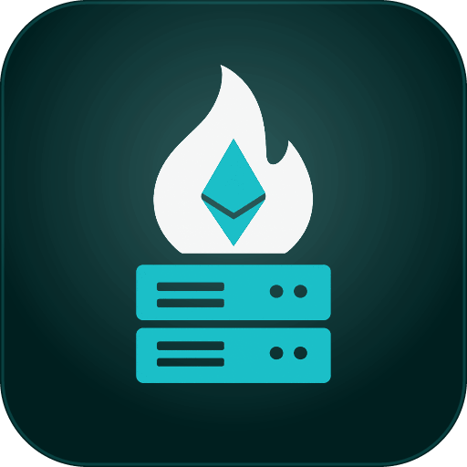
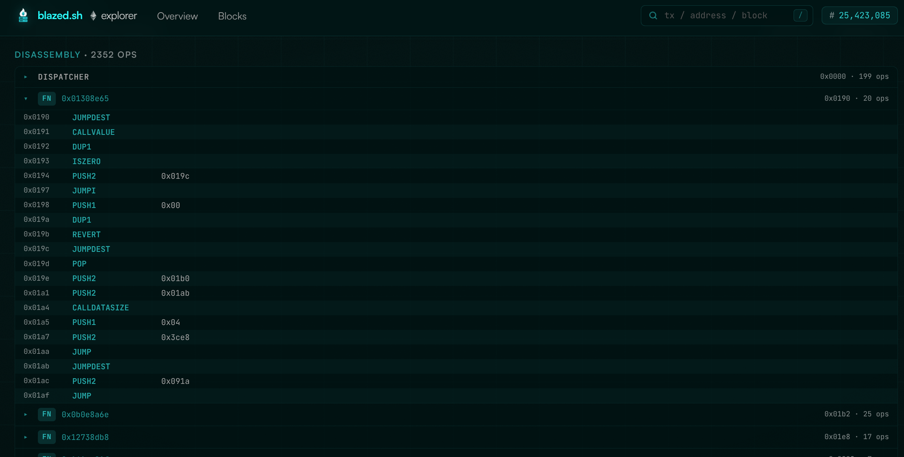

<div align="center">

<h1>
  
  BLAZED.sh RPC ETH Explorer
</h1>

<p>Simplistic Ethereum Block/TX/Contract Explorer that only relies on an RPC connection.</p>
<br />

<table>
  <tr>
    <td align="center" width="50%">
      <br />
      <b>Dashboard</b><br />
      <sub>Live mempool stream &amp; gas</sub>
    </td>
    <td align="center" width="50%">
      <br />
      <b>Block</b><br />
      <sub>Full block &amp; tx breakdown</sub>
    </td>
  </tr>
  <tr>
    <td align="center" width="50%">
      <br />
      <b>Transaction</b><br />
      <sub>Decoded calls, logs &amp; fees</sub>
    </td>
    <td align="center" width="50%">
      <br />
      <b>Contract</b><br />
      <sub>EVM bytecode of contracts</sub>
    </td>
  </tr>
</table>

</div>

---

Simplistic Ethereum Block/TX/Contract Explorer Backend + Frontend that only relies on a RPC connection.
Backend does the RPC requests and stores data in a simple SQLite, live data is provided via WS.

## Features

- Live mempool stream over WebSocket: pending txs as they hit the pool
- Block & transaction explorer backed by SQLite
- Real-time gas tracking and mempool charts
- Search across blocks, txs and addresses
- Decoded calls, event logs and fee breakdowns
- Inspect the EVM bytecode of deployed contracts
- Single static binary with embedded frontend, no external services beyond your node
- Configurable retention with automatic pruning

## Requirements

- An Ethereum node with `eth` and `txpool` API namespaces enabled:
  `--http.api eth,net,web3,txpool --ws.api eth,txpool`
- Go 1.23+, Node 20+

## Run

```sh
cp .env.example .env   # set ETH_HTTP_URL / ETH_WS_URL
make build             # builds frontend + single static binary
./blazed-explorer
```

Open http://localhost:8080.

## Development

```sh
make dev-server        # go backend on :8080
make dev-web           # vite dev server on :5173 (proxies /api and /ws)
```

## Configuration (env)

| Var | Default | |
|---|---|---|
| `ETH_HTTP_URL` | `http://127.0.0.1:8545` | node HTTP RPC |
| `ETH_WS_URL` | `ws://127.0.0.1:8546` | node WS RPC |
| `LISTEN_ADDR` | `:8080` | server listen address |
| `DB_PATH` | `./explorer.db` | SQLite database path |
| `RETENTION_HOURS` | `48` | prune txs older than this |
| `MAX_POOL` | `10000` | in-memory pending pool cap |
| `ALLOW_ORIGINS` | _(empty)_ | comma-separated CORS allowlist for API/WS; only needed for cross-origin frontends. `*` allows any |
| `TLS_CERT_FILE` | _(empty)_ | path to a TLS cert (PEM); takes precedence over ACME |
| `TLS_KEY_FILE` | _(empty)_ | path to the matching TLS private key (PEM) |
| `ACME_ENABLED` | `false` | obtain a Let's Encrypt cert via manual dns-01 |
| `DOMAIN` | _(empty)_ | hostname for the ACME cert (required when `ACME_ENABLED`) |
| `ACME_EMAIL` | _(empty)_ | contact email for expiry notices (optional) |
| `CERT_CACHE` | `./certs` | dir where issued certs + account key are cached |
| `ACME_DNS_WAIT` | `600` | seconds to wait for the TXT record before validating |
| `ACME_DIRECTORY` | _(empty)_ | ACME directory URL; empty = LE production, set staging URL to test |

## HTTPS

The server speaks plain HTTP by default. To serve HTTPS, either point it at your own cert:

```sh
TLS_CERT_FILE=/path/fullchain.pem TLS_KEY_FILE=/path/privkey.pem ./blazed-explorer
```

…or let it obtain a Let's Encrypt cert via a **manual dns-01** flow (no port 80 / inbound
needed — the cert is bound to the hostname, so `LISTEN_ADDR` can be any port):

```sh
ACME_ENABLED=true DOMAIN=explorer.example.com ACME_EMAIL=you@example.com ./blazed-explorer
```

On first run it logs a `_acme-challenge.<domain>` TXT record for you to create, waits
`ACME_DNS_WAIT` seconds, then validates and issues. The cert is cached in `CERT_CACHE` and
reused on restart (re-issued within 30 days of expiry). Use the LE staging `ACME_DIRECTORY`
while testing to avoid rate limits.

## Pointing the frontend at a remote backend

By default the frontend uses same-origin relative paths, so it just works when served by the
backend binary. To host the frontend separately, bake the backend location in at build time
(Vite env vars, see `web/.env.example`):

```sh
cd web
VITE_API_BASE=https://api.example.com npm run build
# VITE_WS_URL is optional; defaults to the WS endpoint derived from VITE_API_BASE
```

Then run the backend with the frontend's origin allowed for CORS:

```sh
ALLOW_ORIGINS=https://explorer.example.com ./blazed-explorer
```
