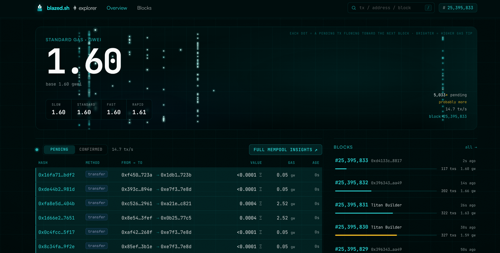
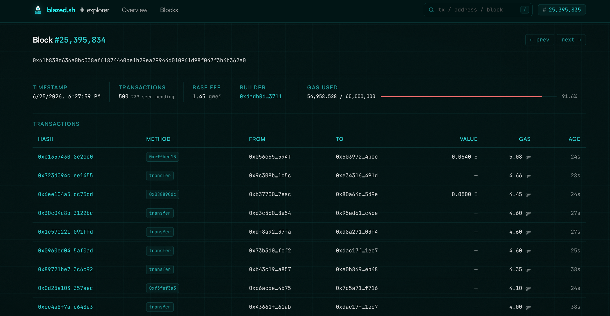
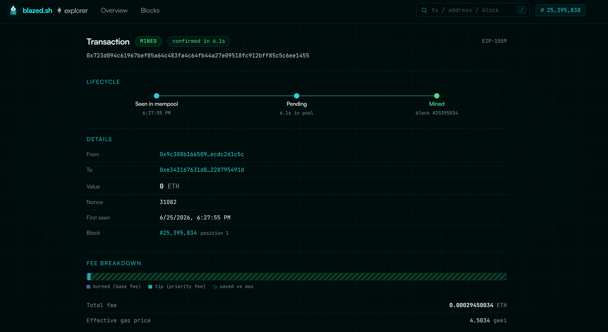

<div align="center">

# 🔥 BLAZED.sh RPC ETH Explorer

<p>Simplistic Ethereum Block/TX Explorer that only relies on an RPC connection.</p>
<br />

<table>
  <tr>
    <td align="center" width="33%">
      <br />
      <b>Dashboard</b><br />
      <sub>Live mempool stream &amp; gas</sub>
    </td>
    <td align="center" width="33%">
      <br />
      <b>Block</b><br />
      <sub>Full block &amp; tx breakdown</sub>
    </td>
    <td align="center" width="33%">
      <br />
      <b>Transaction</b><br />
      <sub>Decoded calls, logs &amp; fees</sub>
    </td>
  </tr>
</table>

</div>

---

Simplistic Ethereum Block/TX Explorer Backend + Frontend that only relies on a RPC connection.
Backend does the RPC requests and stores data in a simple SQLite, live data is provided via WS.

## Features

- Live mempool stream over WebSocket: pending txs as they hit the pool
- Block & transaction explorer backed by SQLite
- Real-time gas tracking and mempool charts
- Search across blocks, txs and addresses
- Decoded calls, event logs and fee breakdowns
- Single static binary with embedded frontend, no external services beyond your node
- Configurable retention with automatic pruning

## Requirements

- An Ethereum node with `eth` and `txpool` API namespaces enabled:
  `--http.api eth,net,web3,txpool --ws.api eth,txpool`
- Go 1.23+, Node 20+

## Run

```sh
cp .env.example .env   # set ETH_HTTP_URL / ETH_WS_URL
make build             # builds frontend + single static binary
./blazed-explorer
```

Open http://localhost:8080.

## Development

```sh
make dev-server        # go backend on :8080
make dev-web           # vite dev server on :5173 (proxies /api and /ws)
```

## Configuration (env)

| Var | Default | |
|---|---|---|
| `ETH_HTTP_URL` | `http://127.0.0.1:8545` | node HTTP RPC |
| `ETH_WS_URL` | `ws://127.0.0.1:8546` | node WS RPC |
| `LISTEN_ADDR` | `:8080` | server listen address |
| `DB_PATH` | `./explorer.db` | SQLite database path |
| `RETENTION_HOURS` | `48` | prune txs older than this |
| `MAX_POOL` | `10000` | in-memory pending pool cap |
